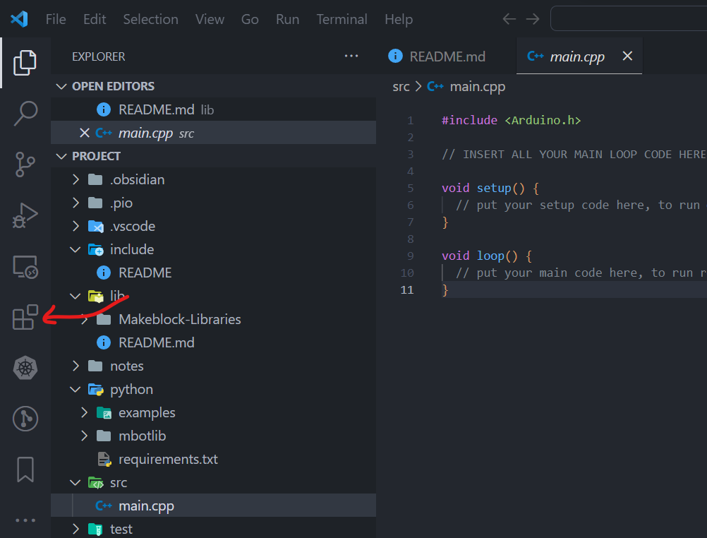
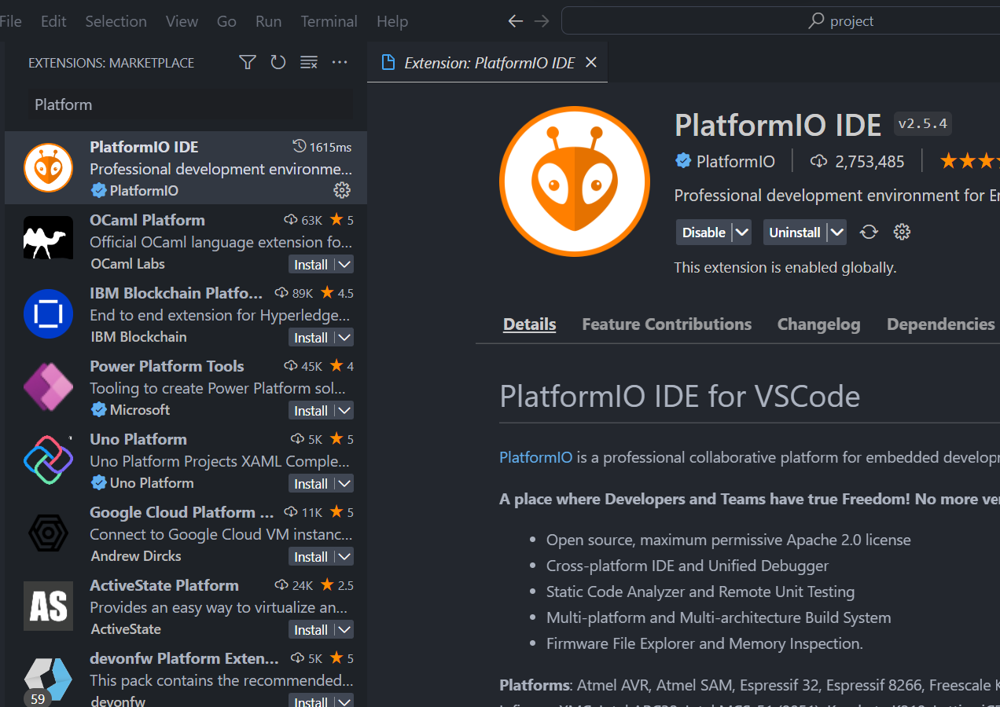

# CG1111A Final Project
> by Group 6B (Tran Duc Khang, Prannaya Gupta, Dexter Tan and Thaw Tun Zan)
>
> AY2022/2023 Semester 1


## Usage Instructions
### Git and GitHub Methods
Firstly, clone this repo, using specifically the following command:
```sh
$ git clone --recurse-submodules https://github.com/ThePyProgrammer/mBotProject.git <project-folder-name>
```

This allows you to install the necessary submodules, which are the libraries.

Next, open this repo in VSCode, via the following command:

```sh
$ code <project-folder-name>
```

### Installing Platform.IO
(in case you want to use the superior choice)


Click on the "Extensions" Tab on the Side Bar and search for "*PlatformIO IDE*".


Once you have installed this, reload the window and check if PlatformIO is able to recognize the project as a PlatformIO Project. This way, we have access to the `Upload`, `Build` and `Serial Monitor` Features.


